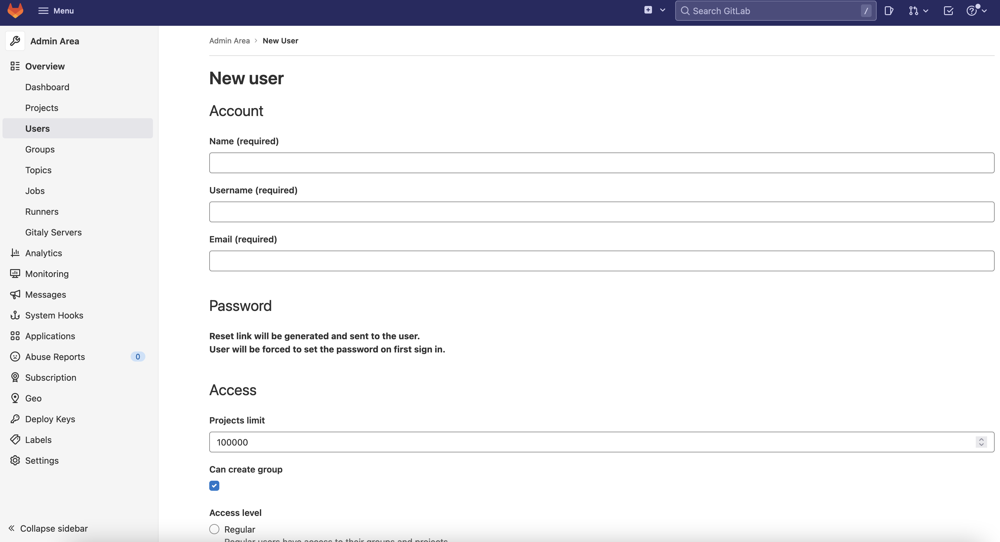
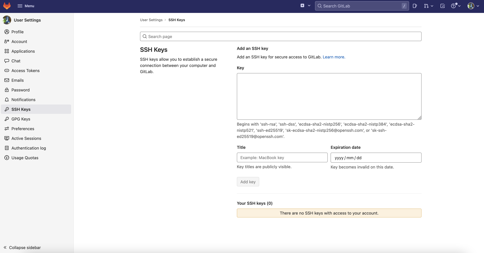

本文示範如何在 Rocky Linux 於內部網路自行架設 GitLab 及 GitLab Runner 服務，並將 GitLab 加入 git remote，最後撰寫 `.gitlab-ci.yml`，透過 GitLab Runner 在 git push 時自動執行 CI 腳本。

<!-- more -->

---

## 設定 Host 環境

### 編輯 `sshd_config`

透過編輯 `/etc/ssh/sshd_config` 檔案來更改 Host 系統使用的 `ssh` port，避免後續透過 `ssh` 與 GitLab 互動時會與系統衝突， `AddressFamily` 改為 `inet` 表示僅允許透過 ipv4 連線

```diff
- Port 22
+ Port 2222
- AddressFamily any
+ AddressFamily inet
```

* 可以先加上 port 2222，確定可以用 port 2222 進行 `ssh` 連線後，再刪除 port 22 這行

接著透過 `semanage` 將 port 2222 加入 ssh 使用的 port 清單後重啟 sshd

```bash
semanage port -a -t ssh_port_t -p tcp 2222
semanage port -l | grep ssh
systemctl restart sshd
```

如果出現 `semanage: command not found` 錯誤，表示系統未安裝此工具程式，可透過以下指令安裝解決

```bash
dnf install -y policycoreutils
```

### 設定防火牆

```bash
firewall-cmd --add-port=2222/tcp --permanent
firewall-cmd --add-port=443/tcp --permanent
firewall-cmd --reload
```

---

## 使用 Podman 建置 GitLab

### 安裝 Podman

```bash
sudo dnf install podman
```

確認已安裝 podman 版本

```bash
podman version
```

在任意目錄如 `/srv/gitlab/` 下建立並編輯 `docker-comose.yml`

```yaml
version: '3.6'
services:
  web:
    image: gitlab/gitlab-ee:latest
    container_name: gitlab
    restart: always
    hostname: 'gitlab'
    privileged: true
    environment:
      GITLAB_OMNIBUS_CONFIG: |
        external_url 'https://gitlab'
        # SMTP server 設定
        gitlab_rails['gitlab_shell_ssh_port'] = 22
        gitlab_rails['smtp_enable'] = true
        gitlab_rails['smtp_address'] = '<smtp server url>'
        gitlab_rails['smtp_port'] = 587
        gitlab_rails['smtp_domain'] = '<smtp server domain name>'
        gitlab_rails['smtp_user_name'] = "<smtp username>"
        gitlab_rails['smtp_password'] = "<smtp password>"
        gitlab_rails['smtp_authentication'] = 'login'
        gitlab_rails['gitlab_email_from'] = 'noreply@my-gitlab'
        gitlab_rails['gitlab_email_reply_to'] = 'root@my-gitlab'
        gitlab_rails['smtp_enable_starttls_auto'] = true
        gitlab_rails['smtp_tls'] = false
        gitlab_rails['smtp_pool'] = false
    ports:
      - '80:80'
      - '443:443'
      - '22:22'
    volumes:
      - './gitlab/config:/etc/gitlab:Z'
      - './gitlab/logs:/var/log/gitlab:Z'
      - './gitlab/data:/var/opt/gitlab:Z'
    shm_size: '256m'
```

* 需要在 volume 對應的容器路徑後面加上 `:Z` 以讓容器有權限寫入

接著用以下指令啟動容器

```bash
podman compose up -d
```

* -d: 表示在背景執行

查看容器 log

```bash
podman logs -f gitlab
```

* -f (--follow): 表示追蹤並即時印出新的log

日後如果要更改設定，可以選擇透過在 `GITLAB_OMNIBUS_CONFIG` 下修改後重上容器，或直接編輯 `gitlab_data/config/gitlab.rb` 做修改  

編輯完畢後執行

```bash
podman exec -it gitlab gitlab-ctl reconfigure
```

---

## 自簽憑證處理

在透過 Omnibus 設定建立的 GitLab 容器，預設會透過 Let's Encrypt 產生自簽憑證，後續註冊 GitLab Runner 時可能會遇到 `x509: certificate relies on legacy Common Name field, use SANs instead` 的問題，這是由於自動產生的憑證缺少 SAN 欄位，需要重新簽署帶有 SAN (Subject Alternative Names) 欄位設定的憑證。

建立並編輯 `gitlab_data/config/ssl/ssl.conf`

```conf
[req]
prompt = no
default_md = sha256
default_bits = 2048
distinguished_name = dn
x509_extensions = v3_req

[dn]
[req]
prompt = no
default_md = sha256
default_bits = 2048
distinguished_name = dn
x509_extensions = v3_req

[dn]
C = TW
ST = Taiwan
L = Taipei
O = gitlab Inc.
OU = IT Department
emailAddress = <YOUR EMAIL>
CN = gitlab

[v3_req]
subjectAltName = @alt_names

[alt_names]
DNS.1 = gitlab
DNS.2 = *.gitlab
IP.1  = <YOUR SERVER IP>
```

由以下指令產生新憑證

```bash
openssl req -x509 -new -nodes -sha256 -utf8 -days 3650 -newkey rsa:2048 -keyout gitlab.key -out gitlab.crt -config ssl.conf
```

憑證公私鑰檔名應該與 `docker-compose.yml` 中的 `external_url` 設定一致。

---

## 設定 GitLab

### 創建管理員帳號

預設管理員帳號為 `root`，密碼則存在 `gitlab/config/initial_root_password` 檔案內，建議登入後點選左上角 `Menu`
&rarr; `Admin` &rarr; `new user` 創建自己的管理員帳號[^1][^2]，並透過確認信所附的連結設定密碼及啟用。



[^1]: 如果建立帳號後沒有收到確認信，請檢查您的 SMTP 設定。
[^2]: 管理員帳號的 Access level 記得選擇 Administrator。

### 創建 Project

有以下幾種做法：

* 從 GitLab 網頁 UI 建立空白 Project
* 使用本地 git repo 創建
* 從 GitHub 等外部 repo 匯入

本文以使用本地 git repo 做為示範，詳見下段。

---

## 將 GitLab 加入開發環境

由於是架設在內部網路，建議操作 git 使用 `ssh` 而不用 `https` ，可以避開很多TLS 憑證衍生錯誤問題。

### 設定 SSH Key

開啟開發環境的 `~/.ssh` 目錄下的 ssh public key 檔案（如 `id_rsa.pub` 或 `id_ed25519.pub`），複製其中內容[^3]。

如 MacOS 可以使用以下指令：

```bash
cat ~/.ssh/id_ed25519.pub | pbcopy
```

[^3]: 如果 Host 環境是 VM，需安裝 VMware Tools 或 Guest Additions 等工具。

如果目錄下沒有公鑰檔，可以用以下指令創建：

```bash
ssh-keygen -t ed25519 -C '<comment>'
```

* 其中 -C 標示該 key 的使用者資訊，通常會是 `<username>@<hostname>.<domain>` ，或是使用者的 email address

點選畫面右上角個人圖示 &rarr; `Preferences`，再點擊畫面左方列表 `SSH Keys`，將剛才複製的 SSH Key 貼到Key欄位，可一併設定有效期限，最後點擊 `Add key`。



### 設定 git remote 及創建 GitLab project

以既有本地檔案初始化 git 並創建 GitLab project

```bash
cd <project_folder>
git init --initial-branch=main
git remote add origin git@<GitLab URL>:<username>/<your repo name>.git
git add .
git commit -m "Initial commit"
git push -u origin main
```

---

## 建置 GitLab Runner

### 編輯 docker-compose 設定檔

在 `docker-compose.yml` 中加入以下段落：

```yaml
  gitlab-runner:
    image: gitlab/gitlab-runner:latest
    container_name: 'gitlab-runner'
    environment:
      - CI_SERVER_URL=https://gitlab
    volumes:
      - '/var/run/docker.sock:/var/run/docker.sock'
      - './gitlab-runner:/etc/gitlab-runner'
    restart: always
```

重新下上容器：

```bash
podman compose down
podman compose up -d
```

在註冊 Runner 之前，需要複製一份前面步驟產生的 GitLab server 憑證 `gitlab.crt` 到 `./gitlab-runner/certs/` 底下。

```bash
touch ./gitlab-runner/config.toml
mkdir ./gitlab-runner/certs
cp ./gitlab/config/ssl/gitlab.crt ./gitlab-runner/certs/
```

### 註冊 GitLab Runner

在 Project 頁面，點擊畫面左方列表 `Settings` &rarr; `CI/CD`，再點擊 Runners 右邊的 `Expand`，複製 `registration token`。執行以下指令並依提示填入內容。

```bash
podman exec -it gitlab-runner gitlab-runner register --tls-ca-file /etc/gitlab-runner/certs/gitlab.crt
```

### 撰寫 GitLab CI 腳本

依照官方提供範例[^4]在專案資料夾根目錄創建並編輯 `.gitlab-ci.yml`。

[^4]: [GitLab CI 模板撰寫指南](https://docs.gitlab.com/ee/development/cicd/templates.html)

```yaml
stages:          # List of stages for jobs, and their order of execution
  - build
  - test
  - deploy

build-job:       # This job runs in the build stage, which runs first.
  stage: build
  only:
    - develop
  tags:
    - "shell"
  script:
    - echo "Compiling the code..."
    - echo "Compile complete."

unit-test-job:   # This job runs in the test stage.
  stage: test    # It only starts when the job in the build stage completes successfully.
  only:
    - develop
  tags:
    - "shell"
  script:
    - echo "Running unit tests... This will take about 60 seconds."
    - sleep 60
    - echo "Code coverage is 90%"

lint-test-job:   # This job also runs in the test stage.
  stage: test    # It can run at the same time as unit-test-job (in parallel).
  only:
    - develop
  tags:
    - "shell"
  script:
    - echo "Linting code... This will take about 10 seconds."
    - sleep 10
    - echo "No lint issues found."

deploy-job:      # This job runs in the deploy stage.
  stage: deploy  # It only runs when *both* jobs in the test stage complete successfully.
  only:
    - develop
  tags:
    - "shell"
  script:
    - echo "Deploying application..."
    - echo "Application successfully deployed."
```

之後做 `git push`，GitLab 便會自動用前面註冊的 runner 配對執行 CI jobs。之後可以在側邊欄 `CI/CD` 選單查看測試結果。
